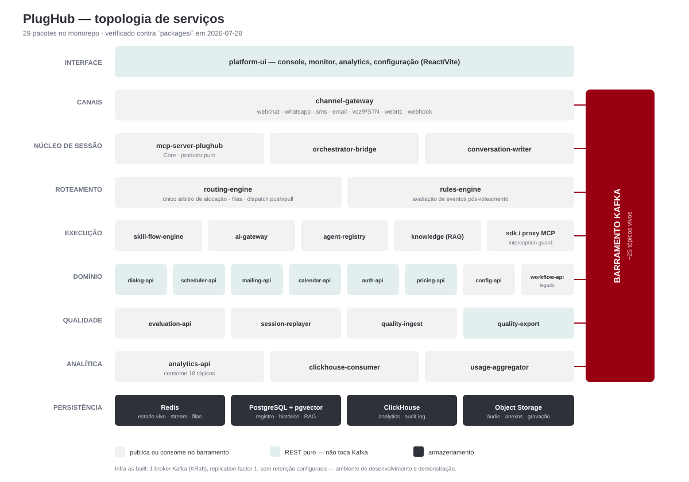
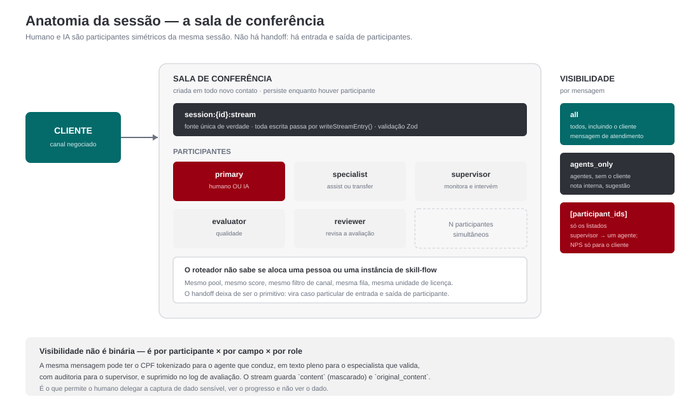

# PlugHub — Descritivo Técnico-Funcional

> **Público:** avaliador técnico (CTO, Head de IA, arquiteto de soluções, CISO/DPO, Head de Contact Center) e
> due diligence técnica.
> **Base:** `CLAUDE.md`, `CHANGELOG.md` até 2026-07-27, varredura de `packages/` e `docs/arcos/`.
> **Data:** julho de 2026 · substitui a versão de 09/06/2026.

Este documento descreve **o que está implementado hoje**. Onde o estado é parcial, está marcado como parcial;
onde é projeto, vive isolado na §25. A §24 registra, com honestidade de engenharia, onde a narrativa de produto
antecede a implementação.

**Selo de evidência** — cada seção principal traz um. É a diferença entre um descritivo e um datasheet:

| Selo | Significado |
|---|---|
| **[real]** | Entregue e validado em operação real (atendimento de ponta a ponta, sem seed) |
| **[smoke]** | Entregue e validado por smoke test ou cenário e2e automatizado |
| **[implementado]** | Código completo e integrado, **ainda não exercitado** em operação nem por teste de ponta a ponta. Não é "parcial" — não falta função; falta validação |
| **[parcial]** | Núcleo entregue, fases declaradas pendentes |
| **[projeto]** | Especificado, não implementado — vive na §25 |

> A distinção entre **[implementado]** e **[smoke]** é a que mais importa numa avaliação honesta. "Existe no
> código" e "foi exercitado" são afirmações diferentes, e confundi-las nas duas direções é igualmente danoso:
> subvender faz dimensionar trabalho já feito; sobrevender quebra a confiança na primeira verificação. O canal de
> voz e o outbound por voz são os casos típicos — completos e pouco exercitados.

**O que mudou desde a versão de junho.** Sete semanas de implementação e três correções factuais: o processo
multi-contato **voltou** (a v1 dizia que a entidade Journey fora eliminada por redundância — foi, mas o modelo
retornou sem entidade, §5); o inventário de serviços subdimensionava a plataforma em cerca de dez serviços (§2);
e o AHT inflado por wrap-up, listado como limitação conhecida, **foi corrigido** e é hoje uma das melhores provas
do modelo (§4). Entraram como seções novas: Outbound (§8), Scheduler (§9), Dialog primitive (§10), Quality
Ingest/Export (§18) e a fila de trabalho humano (§11.4, §20).

---

## Índice

**Fundação** — §1 Sumário · §2 Arquitetura · §3 Modelo de sessão · §4 Ciclo de vida · §5 Processo multi-contato
**Execução** — §6 Canais · §7 Skill Flow · §8 Outbound · §9 Scheduler · §10 Dialog primitive · §11 Routing
**Identidade e IA** — §12 Identidade · §13 AI Gateway
**Conformidade** — §14 MCP guard · §15 Masking · §16 Controle de acesso
**Qualidade e dados** — §17 Avaliação · §18 Quality Ingest/Export · §19 Monitoria e auditoria
**Operação e comercial** — §20 Console · §21 Billing · §22 SDK e portabilidade
**Contratos** — §23 Invariantes · §24 Limitações · §25 Roadmap

---

## 1. Sumário executivo — a virada de categoria

O mercado de agentes de IA para atendimento convergiu, em 2025–2026, em três arquétipos, cada um com um buraco
estrutural: **hyperscalers agentic** (Gemini Enterprise, Agentforce) vendem "agentic everything" com lock-in e
pricing multidimensional; **CCaaS com IA** (Genesys, NICE/Cognigy, Five9, Talkdesk) são maduros em telefonia mas
a camada agentic é evolução de NLU legado; **orquestradores dev-first** (LangGraph, CrewAI, n8n) são excelentes
primitivas e não são CCaaS — falta console de operação, replay, roteamento skill-based e o conceito de agente
humano como participante de primeira classe.

Os três competem dentro de dois modelos mentais. O CCaaS é **interaction-centric** — a unidade é a interação, e
os KPIs são AHT, FCR e SLA por interação. O CRM é **record-centric** — a unidade é o registro, e a interação é um
campo nele. Os dois coexistem mal: uma *case* no Service Cloud pode agrupar seis interações, mas roteamento, SLA
e qualidade continuam medidos por interação.

O PlugHub propõe um terceiro modelo, **process-centric**: a unidade de gestão é o **processo de negócio do
cliente**, que atravessa múltiplos contatos, canais, dias e participantes — humanos e IA —, com SLA, roteamento e
analytics medidos no nível do processo e drilláveis até o turno individual.

E uma decisão de fundação sustenta tudo o mais: **humano e IA são duas implementações da mesma interface**,
coexistindo na mesma sessão. Todo concorrente da lista acima modela a IA como etapa *anterior* ao atendimento e o
humano como anteparo — assimetria que está no modelo de sessão, no roteador, no licenciamento e no relatório.

Cinco pontos que um avaliador técnico deve verificar primeiro:

1. **Sala de conferência unificada** (§3) — não há handoff visível ao cliente; há entrada e saída de
   participantes na mesma sala, com visibilidade configurável por participante, por campo e por role.
2. **Ciclo de vida em três camadas** (§4) — contato ≠ segmento ≠ conferência. É o que permite o pós-atendimento
   rodar sem inflar o AHT.
3. **MCP como protocolo único, com interception guard como invariante** (§14) — nenhuma chamada a sistema de
   negócio escapa de validação de permissão, guarda anti-injeção e auditoria não-optável.
4. **Motor único de fluxo** (§7) — o mesmo artefato declarativo serve inbound, outbound, workflow, especialista e
   hook. O arco de outbound (§8) foi entregue sobre ele, sem stack paralela.
5. **Billing por capacidade** (§21) — licenças simultâneas, humanos e IA na mesma unidade. Custo previsível do
   mês 1 ao mês 13.

---

## 2. Arquitetura e topologia de serviços

> **[real]** — em operação no ambiente demo

### 2.1 Event-driven, stateless, estado externalizado

O backbone é **Kafka**; os componentes são **stateless por padrão**. O estado de tempo real vive no **Redis**, não
nos processos: `pipeline_state`, filas, heartbeats, ContextStore e o *canonical stream* da sessão. Qualquer
instância de qualquer componente pode cair e ser substituída sem perda de estado de sessão, porque o estado não
está nela.

Duas consequências verificáveis:

- Agentes que precisam manter estado entre turnos declaram `execution_model: stateful` e o Routing Engine garante
  **afinidade de sessão**. O AI Gateway é estritamente stateless — um turno por chamada de LLM. É invariante, não
  convenção.
- Consumers Kafka críticos têm retry e **dead-letter queue** (`events.dead_letter`). A reconciliação de
  instâncias é estilo Kubernetes: um controlador compara estado desejado (Agent Registry) contra estado real
  (Redis) e aplica o diff mínimo, com heartbeat de 15s e reconciliação periódica de 5min.

### 2.2 Topologia de persistência

| Banco | Uso |
|---|---|
| **Redis** | Estado de conversa em tempo real, `pipeline_state`, filas, heartbeats, ContextStore, canonical stream, tokens de retomada |
| **PostgreSQL + pgvector** | Agent Registry; schemas `auth`, `workflow`, `evaluation`, `identity`, `dialog`, `scheduler`, `outbound`; histórico de sessões; base vetorial (RAG) |
| **ClickHouse** | Analytics operacional, audit log, métricas de qualidade, sinais de cliente |
| **Object Storage** | Áudio de ligações, anexos, gravações WebRTC |

### 2.3 Inventário de serviços

Monorepo com **22 serviços Python** e **7 pacotes Node**, dependências explícitas e sem ciclos (`schemas` não
depende de ninguém; pacotes TypeScript nunca dependem do `ai-gateway`).

**Núcleo de sessão e roteamento** — `mcp-server-plughub` (Core: runtime de agente e ferramentas MCP),
`routing-engine` (único árbitro de alocação: filas, scoring, dispatch push/pull, `close_reason`),
`orchestrator-bridge` (reconciliação de instâncias, hooks de pool, ponte skill-flow↔sessão), `channel-gateway`
(adapters, normalização inbound, render outbound, identidade), `rules-engine` (eventos pós-roteamento),
`conversation-writer` (persistência do stream).

**Fluxo e agentes** — `skill-flow-engine` (interpretador do grafo, 15 tipos de step), `skill-flow-worker`
(consumer legado), `agent-registry` (CRUD de AgentType/Pool/Skill, slots de deploy, hot-reload), `ai-gateway`
(inferência, multi-conta, fallback), `mcp-server-knowledge` (base vetorial, porta 3401).

**Processo, agenda e contato ativo** — `workflow-api` (3800, legado), `scheduler-api` (3650), `mailing-api`
(3660), `calendar-api` (3700), `dialog-api` (3760).

**Qualidade e conformidade** — `evaluation-api` (3400), `session-replayer`, `quality-ingest` (3850),
`quality-export` (3852), `auth-api` (3200).

**Dados, custo e interface** — `analytics-api`, `clickhouse-consumer`, `usage-aggregator`, `pricing-api` (3900),
`config-api`, `platform-ui`.

> **Fato de arquitetura:** os três serviços de domínio mais novos — `dialog-api`, `scheduler-api`, `mailing-api` —
> são **REST puro**. Integram-se ao barramento indiretamente, via tools MCP chamadas por agentes ou via o webhook
> de canal, em vez de publicar eventos próprios. A matriz completa de quem produz e consome cada tópico está em
> [`kafka-eventos.md`](../kafka-eventos.md) § Matriz módulo × tópico.

### 2.4 Multi-tenant

Isolamento por `tenant_id` pervasivo: chaves Redis (`{tenantId}:...`), schemas PostgreSQL, `accessible_pools[]` e
`module_config` no JWT, segredos por tenant (ex.: `{tenant_id}:config:webchat:jwt_secret`). A Config API dá
override por namespace de praticamente todo parâmetro operacional.

> **Limitação (§24.2):** a fundação é pervasiva, mas o **isolamento operacional multi-tenant completo está em
> maturação**. Para SaaS multi-tenant em produção, é o item nº 1 a validar em prova de conceito.

### 2.5 Invariantes de configuração

Quatro regras que evitam a deriva típica de plataformas configuráveis, com guard automatizado
(`infra/check_config_invariants.py`, que falha em violação nova):

- **Uma fonte por domínio** — cada domínio tem UM store canônico. Config nunca duplicada entre stores.
- **Provisionamento só via API oficial** — proibida escrita direta em Redis/DB de config, inclusive em seed.
- **Todo campo de config é editável na UI** — campo que só existe em YAML é dívida declarada.
- **`env` só para segredo e topologia** — quando `env` e config-api têm a mesma chave, **config-api vence**.

---

## 3. Modelo de sessão unificado — a sala de conferência

> **[real]**

Este é o diferencial estrutural mais importante e o mais difícil de copiar.

**Todo contato é uma sala de conferência.** O Core cria a sessão em todo novo contato; agentes entram na sala com
seus papéis e recebem mensagens segundo regras de visibilidade. O Redis stream `session:{id}:stream` é a **fonte
única de verdade** de todos os eventos da sessão — toda escrita passa por `writeStreamEntry()`, com validação Zod
e `event_id` garantido.

**Papéis de participante:** `primary` (agente principal — humano **ou** IA), `specialist` (especialista
convidado), `supervisor` (monitoramento), `evaluator` (avaliação), `reviewer` (revisão da avaliação).

**Visibilidade por mensagem:**

| Visibilidade | Destinatários | Uso típico |
|---|---|---|
| `all` | Todos, incluindo o cliente | Mensagem normal de atendimento |
| `agents_only` | Todos os agentes, sem o cliente | Nota interna, sugestão de especialista |
| `["part_abc", …]` | Apenas os `participant_id` listados | Supervisor → um agente; NPS só para o cliente |

A consequência competitiva: **humano e IA são simétricos**. Um especialista de IA entra numa sessão conduzida por
humano e sugere respostas que só o agente vê; um supervisor injeta mensagem privada para um único participante;
um agente de IA conduz e transfere para humano sem o cliente perceber transição. Nos concorrentes, IA→humano e
humano→IA são **handoffs** — transferência com contexto perdido e script diferente. Aqui é entrada e saída de
participantes na mesma sala, com o mesmo stream e o mesmo contexto.

**Status de sessão:** `active`, `suspended` (workflow aguardando sinal externo, com TTL estendido no Redis),
`closed`, `abandoned`. **Domínio de `close_reason`** normalizado — `no_resource`, `max_wait_exceeded`,
`customer_disconnect`, `customer_hangup`, `customer_abandon`, `flow_complete`, `agent_transfer`, `agent_hangup`,
`session_timeout`, `system_error` — base de relatórios consistentes de desfecho.

**ContextStore.** Hash Redis `{tenantId}:ctx:{sessionId}` com namespaces por escopo: `caller.*` (dados do
cliente), `session.*` (estado da sessão), `account.*`, `segment.{segId}.*` (isolado por agente paralelo) e
`journey.*` (compartilhado pelo processo, §5.3). Cada entrada carrega `value`, `confidence` (0–1), `source`,
`visibility` e `updated_at` — a proveniência do dado é rastreável (`mcp_call`, `ai_inferred`, `customer_input`).
`@ctx.*` resolve em inputs de step, condições de `choice` e arrays de visibilidade.

---

## 4. Ciclo de vida em três camadas

> **[real]** — o wrap-up destacado foi validado em atendimento real, sem seed (2026-07-27)

Três coisas que a maioria das plataformas trata como uma só:

| Camada | O que é | Quando termina |
|---|---|---|
| **1 — Contato** | A perspectiva do cliente | Quando o cliente sai — **as estatísticas congelam aqui** |
| **2 — Segmento** | A janela de cada participante | Em `agent_done` — o recurso do pool é liberado aqui |
| **3 — Conferência** | A sala (infraestrutura) | Quando o último participante sai |

Colapsar essas camadas é a causa de uma dor universal e normalizada no setor: **o wrap-up infla o AHT**. O cliente
já foi embora, mas o contato só fecha quando o agente termina a disposição — então o AHT reportado inclui um tempo
em que ninguém estava sendo atendido, e o agente fica bloqueado enquanto isso.

**A correção, e por que ela prova o modelo.** O hook `on_human_end` ganhou `dispatch: detached`: o contato fecha
no instante em que o cliente sai (o AHT vira verdade) e a disposição vira **item de trabalho assíncrono** na fila
pull do próprio agente, reivindicável quando ele puder. O outcome é gravado por **referência** no segmento de
origem (`origin_session_id` + `surveyed_segment_id`, via a tool `segment_outcome_record`) — o wrap-up não é
fisicamente um segmento da conferência.

Isso só foi possível porque as camadas já estavam separadas no modelo. É o exemplo mais limpo de arquitetura
virando efeito operacional mensurável.

**Modelo de wrap-up unificado (2026-07-27).** O wrap-up *inline* passou a ser auto-atendimento sobre a **mesma
máquina** do detached; a capacidade é uma vaga só, controlada pelo semáforo de claim de instância. No fechamento
com wrap-up inline, a vaga é **trocada** por um hold que o auto-claim do wrap-up herda — a ocupação nunca oscila e
o push não toma a vaga na janela. Holds expirados são descartados em qualquer claim, contra vazamento.

**Gaps remanescentes** (registrados, §24.9): `remaining` não considera todos os especialistas de IA em alguns
caminhos; supervisor sem cleanup de heartbeat em certos cenários; a sessão de wrap-up ainda entra na contagem de
contato/TMA (isenção pendente).

---

## 5. Processo multi-contato — journey por union-find

> **[parcial]** — J1–J3 e J5a entregues e validados; drill N3 na Vista Processos pendente

### 5.1 O problema

Um processo real — portabilidade, cobrança, onboarding — atravessa vários contatos, canais e dias. O CCaaS mede
interação; o CRM guarda registro. Nenhum dos dois dá **SLA por etapa com o roteador ciente**.

A consequência é conhecida: quatro contatos pelo mesmo problema viram quatro registros e três falhas de FCR, e
ninguém responde quanto custou resolver o processo do início ao fim.

### 5.2 Por que a entidade foi eliminada — e por que o modelo voltou

O Arc 10 tinha uma entidade `Journey` com lifecycle, merge e split próprios. Foi **removida no Arc 19** por
redundância e custo: duas entidades de agrupamento (sessão e journey) com ciclos independentes geram estados
inconsistentes que ninguém reconcilia.

O que voltou em julho **não é a entidade**. É um modelo sem entidade, sem lifecycle e sem split:

- **Identidade por proveniência.** Toda sessão carrega `root_session_id` imutável, nunca nulo — propagado do
  chamador ou auto-atribuído como si mesma.
- **União por alias.** A tool MCP `journey_merge` publica em `journey.merges`; o consumer materializa
  `journey_aliases` (ClickHouse, `ReplacingMergeTree`). O merge é **sempre novo → antigo**, o que dá ordem total
  e, portanto, ausência de ciclo — sem depender de relógio. Nunca reescreve `root_session_id`: grava só a aresta.
- **Resolução na leitura.** A journey é a **componente conexa** de sessões sob (proveniência ∪ alias),
  identificada pela **raiz canônica**, resolvida por **union-find** no momento da consulta.

> A decisão de projeto que fecha o desenho: a aciclicidade **não pode depender de timestamp**. Uma versão anterior
> comparava `started_at` para ordenar o merge — e metade dos canais não escrevia esse campo. A correção não foi
> fazer o timestamp funcionar; foi ver que a ordem "novo → antigo" já é total por construção.

### 5.3 Contexto compartilhado do processo

`@ctx.journey.*` resolve no hash do **processo**, não da sessão: `{tenant}:ctx:journey:{raiz canônica}`, TTL 30
dias. A raiz é resolvida pela mesma via do bridge (proveniência → union-find), e no merge o contexto migra com a
regra "canônica vence". Leitura, escrita automática via `context_tags`, escrita imperativa (`context_set`, injeção
de supervisor) e migração no merge passam todas pelo helper único `writeContextTag` — não há caminho que grave
contexto de processo no lugar errado.

### 5.4 O que entrega

Drill de três níveis (processo → contato → segmento); SLA e métricas no nível do processo com detalhe até o turno;
sinal de cliente endereçável ao **grão** processo, não só ao contato (§17.5); contexto que sobrevive à troca de
canal e à espera de dias.

> **Vs. concorrência:** Pointillist (Genesys) e Adobe CJA fazem analytics de jornada **sem amarração ao roteador**;
> o `case` do Salesforce é record-centric e vive fora do motor de atendimento; o `thread` do LangGraph é técnico,
> não de negócio. Aqui o processo é simultaneamente operacional e analítico.

---

## 6. Canais — omnichannel com voz e WebRTC nativos

> **[real]** para webchat, WhatsApp, SMS, e-mail, webhook · **[implementado]** para voz/PSTN e WebRTC
>
> Voz e WebRTC estão **completos e integrados** — tronco PSTN via Twilio, STT e TTS de provedores externos atrás
> das três interfaces, SFU LiveKit com gravação e supervisão. O que falta não é função: é **exercício em
> operação**. É a diferença entre o selo [implementado] e o [real].

O modelo "todo contato é conferência" aplica-se **sem mudança** a todos os canais. O que varia é apenas como o
cliente entra na sala e como mensagens entram e saem. Para texto há um plano só (controle = Redis stream +
Kafka); para voz emerge um segundo plano (mídia = conference room do CPaaS), e o `VoiceAdapter` é a única ponte.

**Premissa central:** agentes de IA são **sempre texto**. Em voz, STT converte fala→texto na entrada e TTS
converte texto→áudio na saída; o pipeline central (AI Gateway, ContextStore, Skill Flow, qualidade) opera sempre
em texto e não muda por canal.

| Canal | Transporte | Provedores | Observações |
|---|---|---|---|
| **Webchat** | WebSocket persistente | Próprio | Upload em 2 estágios, typing, masked fields, reconexão por cursor (zero perda) |
| **WhatsApp** | Webhook HTTP | Meta Cloud API (BSPs via `IWhatsAppProvider`) | Botões (≤3), list (4–10), fallback de coleta sequencial |
| **SMS** | Webhook HTTP | Twilio (extensível via `ISMSProvider`) | Concatenação, coleta sequencial, segmentação outbound |
| **E-mail** | Webhook HTTP | Mailgun (extensível) | Correlação Reply-To → In-Reply-To → endereço; strip de quoted text |
| **Voz / PSTN** | Webhook + WS de mídia | Twilio (tronco) + Deepgram (STT) + ElevenLabs/Aura (TTS) | Bot leg na conference; DTMF e STT por step; outbound via `collect` |
| **WebRTC** | Signaling WS + SFU | LiveKit self-hosted | Negociação **vídeo → voz → texto**; tokens emitidos só pelo Channel Gateway |
| **Webhook** | HTTP | Próprio | Workflows como canal (Arc 19); cada pool webhook é um endpoint |

**Abstração de providers.** Toda integração externa fica atrás de um `Protocol`: trocar Twilio por Telnyx em SMS,
ou Mailgun por SES, **não toca o adapter**. Em voz, três interfaces independentes (`IVoiceProvider`,
`ISTTProvider`, `ITTSProvider`) com encadeamento de fallback — ElevenLabs → Twilio Say como último recurso que
nunca falha; Deepgram → Mock que mantém a chamada viva.

**Invariante WebRTC:** tokens LiveKit são emitidos exclusivamente pelo Channel Gateway, nunca expostos ao browser.

---

## 7. Skill Flow — motor único de fluxo

> **[real]**

Interpretador de grafo de estados que persiste `pipeline_state` no Redis **a cada transição de step** — invariante:
nunca só em memória.

### 7.1 Os quinze tipos de step

| Tipo | Faz | Interage com |
|---|---|---|
| `task` | Delega a um agente via A2A (`assist`/`transfer`) | Routing Engine |
| `choice` | Ramificação condicional (JSONPath) | pipeline_state |
| `catch` | Retry e fallback antes de escalar | pipeline_state |
| `escalate` | Roteia para um pool | Rules Engine |
| `complete` | Encerra com outcome definido | agent_done |
| `invoke` | Chama ferramenta MCP diretamente | MCP Server |
| `reason` | Invoca o AI Gateway com `output_schema` | AI Gateway |
| `notify` | Mensagem unidirecional ao cliente | Core → Channel Gateway |
| `menu` | Captura input do cliente, suspende até resposta | Core → Channel Gateway |
| `suspend` | Suspende até sinal externo (aprovação/input/webhook/timer) | Redis TTL |
| `collect` | Contata alvo via canal e aguarda resposta (outbound) | Channel Gateway |
| `resolve` | Acumulação inline de contexto (pipeline de 5 fases) | ContextStore + AI Gateway |
| `receive` | Suspende aguardando a próxima mensagem de qualquer participante | Redis BLPOP |
| `loop` | Percorre um array em N turnos sequenciais | pipeline_state |
| `begin`/`end_transaction` | Bloco atômico de input mascarado | apenas em memória |

**Segregação por perfil (Arc 19).** O perfil `workflow` (canal webhook) permite
`task/choice/catch/escalate/complete/invoke/reason/suspend/collect/receive/loop` e **proíbe**
`menu/notify/begin/end_transaction`. O perfil `agent` (demais canais) permite os de interação com cliente e
**proíbe** `suspend/collect`. Validado no parse do YAML **e** por guarda no engine — o processo nunca toca canal,
o que é o que garante a abstração de mídia.

**Modos de `menu`:** `text`, `button` (≤3 no WhatsApp), `list`, `checklist`, `form` — com fallback por canal
resolvido no adapter, nunca no fluxo. `MenuStep` tem `validation` + `retry`: falha de **formato** faz reprompt na
mesma superfície, honra `max_attempts` e esgota para `on_failure`. Timeout e desconexão não são retry.

**Validação (`validateFlow`):** adjacência fechada (todo destino existe) + guarda de ciclo, antes de publicar.

**Parametrização por deploy.** `$.config.*` resolve o `config_json` do slot do pool em runtime: o mesmo skill roda
com configurações diferentes em pools diferentes. `menu.options`/`fields`/`interaction`/`visibility` aceitam união
`valor | ref`, resolvida por `resolveDynamicValue`.

### 7.2 Versão é do deploy, não do artefato

`skill_id` é **estável** — o deploy não muda o id. A identidade de versão é o **`set_at` do slot `current` do
pool** (momento do promote), carimbada em `segments.deploy_version`. O editor escreve `skill.flow_draft`
(rascunho) e **não vaza para produção**; só o deploy (set-next → promote) preenche o que roda. O bridge executa o
**snapshot do slot do pool**, com cache invalidado pelo `registry.changed` do promote.

**Lifecycle de deploy:** `PUT /v1/skills/:id` sempre grava `deploy_status=draft`; `POST /v1/skills/:id/deploy`
publica. **Hot-reload** em três elos (publicação → `registry.changed` → invalidação de cache) sem restart.
**Graceful shutdown** via `GET /v1/skills/:id/handoff-status` — a versão nova só assume novos contatos, drenando
os em andamento. **Rollback** restaura o `yaml_snapshot` anterior. **Deploy agendado** via workflow.

> **O POOL é a unidade endereçável, nunca o `skill_id`.** Hooks, `workflow_trigger`, endpoints de canal e qualquer
> disparo apontam para um **pool**; o skill e sua config são detalhe interno do deploy. Endereçar por skill reabre
> a pergunta que o modelo de slots existe para fechar — *qual config está rodando?* —, porque o mesmo skill pode
> estar em N pools com configs diferentes. Nesse regime o router **rejeita** por ambiguidade.

---

## 8. Outbound — mailing, campanha e governança de contato

> **[smoke]** — Fases 1–5 validadas por smoke end-to-end · UI entregue

Outbound não é módulo — é **o mesmo motor** com um substrato de audiência. Três entidades no schema `outbound`,
todas genéricas: **mailing** (audiência), **campaign** (orquestrador fino que endereça um **pool**, nunca um
skill) e **campaign_delivery** (estado por campanha).

### 8.0 O lote é um contorno, não um requisito

Vale entender por que o modelo de campanha ocupa, aqui, um lugar **menor** do que nas plataformas tradicionais.

Num CCaaS convencional, dar continuidade a um processo só tem uma forma de ser expressa: **colocar o cliente numa
lista e disparar uma campanha em lote**. Prometeu retorno em três dias? Vira entrada de mailing. Precisa do
segundo passo de uma negociação? Vira campanha. Não porque o lote seja a forma natural da necessidade, mas porque
é a única primitiva que a plataforma oferece — não há como dizer *"este processo, desta pessoa, tem um próximo
passo naquele momento"*. O usuário é obrigado a remodelar a operação em ciclos de disparo e resposta.

No modelo unificado, a continuidade é **um passo do próprio processo**: `suspend` com timer em horário útil, ou
`collect` contatando o alvo pelo canal negociado, dentro do mesmo `session_id` e do mesmo processo. Não há lista,
não há lote, não há módulo separado, não há remodelagem.

**A consequência é a que importa para avaliar a lacuna do §8.4:** boa parte do que hoje trafega como "campanha
outbound" numa operação é, na verdade, **continuidade de processo forçada a caber num lote**. Essa fatia não
precisa de pacing preditivo — precisa do contato certo, para a pessoa certa, no momento certo, e isso é 1:1 e
dirigido por tempo, não por lista.

O substrato de campanha continua existindo e sendo necessário — para o que é **genuinamente massivo**: cobrança de
carteira inteira, campanha de venda ativa, pesquisa em larga escala. Mas ele deixa de ser o organizador da
operação e vira o que deveria sempre ter sido: **uma ferramenta entre outras, consumida pelo processo**. Não por
acaso, o primeiro consumidor do substrato foi o survey, e não o contrário.

Duas invariantes de modelagem:

- **O metadado da entrada é opaco** — contrato entre produtor e consumidor; a plataforma não o interpreta.
- **Membership ≠ supressão.** Estar na audiência (`mailing_entries`) é diferente de ter sido contatado
  (`campaign_deliveries`). Confundir os dois é o que faz campanhas reenviarem para quem pediu para sair.

A unidade de entrada é o par **(pessoa, contexto)** — não a pessoa. O mesmo cliente pode ter duas entradas por
dois motivos.

### 8.1 Governança de contato — o motor de fadiga

Motor **agnóstico de canal e de campanha**, em camadas de precedência:

1. **Opt-out global** (`do_not_contact` no cadastro) — precedência máxima, salvo campanha `transactional`.
2. **Janela de contato** — consulta o `calendar-api` pelo calendário da campanha; fechado → `outside_window`
   **sem consumir cota**.
3. **Fadiga** — `contact_policy` em camadas (campanha sobre tenant): `frequency_caps`, `quarantine_after`,
   `channel_caps`, janelas de `30s` a `7d`.
4. **Supressão de mailing** — `mailing_unsubscribe` marca a entrada sem afetar outras campanhas.

A decisão sempre **nomeia a regra** que a produziu. O `claim=true` grava o fato de contato na **mesma transação**
da decisão — a janela de fadiga começa no envio, não na tentativa. Falha do calendário degrada para *aberto*, mas
**barulhento** (nunca em silêncio).

#### Por que fadiga de cliente não existe nas plataformas atuais

Vale separar dois problemas que costumam ser confundidos:

- **Supressão (DNC)** — *posso contatar esta pessoa?* É binário, por lista. Toda plataforma de outbound tem.
- **Fadiga** — *quanta pressão esta pessoa já recebeu, por todos os canais e todas as campanhas, na janela
  relevante?* É acumulativo, centrado na pessoa. **Praticamente nenhum discador de mercado responde.**

A ausência não é descuido — é consequência de arquitetura. Nos incumbentes, o outbound é módulo, e frequentemente
**um módulo por canal**: o discador de voz tem a sua lista e a sua supressão; o disparo de SMS costuma ser outro
produto, às vezes de outro fornecedor; a campanha de WhatsApp é um terceiro. Não há ledger de contato no nível do
**cliente** porque os canais são literalmente sistemas diferentes. Some-se a isso que a unidade do discador é a
**entrada de lista**, não a pessoa: ele sabe se ligou para aquele registro, não quantas vezes aquele ser humano
foi tocado por alguém da casa nos últimos sete dias. E, no plano organizacional, as campanhas pertencem a áreas
distintas — cobrança, retenção, marketing, pesquisa — e ninguém é dono da pressão agregada.

Aqui o fato é `cliente × canal × campanha × momento`, num ledger único, com política em camadas (campanha sobre
tenant). Uma pessoa contatada pela cobrança no WhatsApp **conta** quando a retenção quiser ligar. Isso só é
possível porque canais e campanhas vivem na mesma plataforma e o motor de elegibilidade é **agnóstico de canal e
de campanha** por construção — ele foi deliberadamente generalizado a partir do caso de survey, não colado depois.

**Por que isso deixou de ser cortesia e virou risco.** A dimensão *frequência* vem sendo regulada, não só a
dimensão *permissão*: cadastros de bloqueio como o "Não Me Perturbe", regras de telemarketing, restrições a
cobrança abusiva e, fora do Brasil, o TCPA. O dado que sustenta a defesa — quem foi contatado, por qual regra,
com qual decisão e por quê — é subproduto natural deste desenho e trabalho manual em qualquer outro.

> **Extensão que a arquitetura abre e que ainda não foi construída:** como esta é também a plataforma de
> **inbound**, o mesmo ledger poderia contabilizar o contato receptivo — não ligar para quem acabou de ligar. Não
> está implementado; está registrado aqui porque é exatamente o tipo de capacidade que só existe quando inbound,
> outbound e todos os canais compartilham o mesmo modelo.

### 8.2 Execução: dispatcher + worker

O disparo é uma agenda recorrente que drena um lote (`campaign_drain`, claim atômico com `FOR UPDATE SKIP
LOCKED`) — o **pacing é a própria recorrência**, sem loop de discagem. Cada entrada vira um `workflow_trigger`
fire-and-forget para um pool de worker, que roda um contato por vez em paralelo: verifica elegibilidade com claim,
ramifica e contata via `collect`. O paralelismo é o `max_concurrent` do pool mais a fila normal — nenhuma
infraestrutura nova de concorrência.

### 8.3 Importador

Adaptador anti-corrupção em **duas camadas**. A **camada pública** recebe linhas normalizadas, resolve o
`customer_id` (nativo ou por âncoras via resolvedor de identidade, §12), valida e reporta
`{total, added, deduped, resolved, unresolved, rejected}`. A **camada de arquivo** lê CSV/xlsx aplicando o
`column_map` do mailing e remapeia rejeições para número de linha. Rejeita-linha-e-continua: arquivo sujo nunca
aborta a importação. Teto síncrono configurável (default 5.000 linhas → 413).

### 8.4 O que existe e o que falta — com precisão

A distinção aqui é entre **capacidade** e **otimização**, e confundir as duas subvende o produto.

**Existe e funciona:** o substrato de campanha completo (mailing, campanha, delivery, governança de fadiga,
importador, fan-out dispatcher/worker) e o **contato ativo por qualquer canal**, inclusive **voz** — o step
`collect` dispara o contato e o `VoiceAdapter` executa a discagem sobre o tronco PSTN. Uma campanha outbound de
voz **roda**.

**Falta a camada de otimização de discagem:** pacing preditivo — os algoritmos que estimam taxa de atendimento
para maximizar a ocupação do agente —, além do guard de *abandonment ratio* (TCPA/LGPD) e das listas DNC como
**invariantes do motor**, e não responsabilidade do YAML (§25.3).

**A consequência prática:** em volume moderado, a operação funciona. Em alto volume de **lista**, a ocupação de
agente fica abaixo do que um discador preditivo maduro entrega — é aí que os incumbentes têm vantagem, e é
otimização de eficiência, não ausência de função.

**E a lacuna é mais estreita do que parece**, pelo motivo do §8.0: a parcela do outbound que é continuidade de
processo — retorno prometido, segundo passo de negociação, coleta assíncrona — é 1:1 e dirigida por tempo, e
**não se beneficia de pacing preditivo**. O gap real se restringe à campanha genuinamente massiva sobre lista
indiferenciada. Para uma operação centrada em processo, ele pode nem aparecer; para um BPO contratado justamente
para discagem de carteira em massa, ele é material e deve ser dito.

> **Selo:** o substrato de campanha é **[smoke]** (Fases 1–5 com smoke end-to-end). O **outbound por voz** é
> **[implementado]** — completo, pouco exercitado. Validá-lo é item explícito de teste, não de construção.

> **Vs. concorrência:** nos incumbentes, outbound é módulo licenciado à parte, com configuração, billing e time
> próprios, e os agentes de IA não atravessam a fronteira inbound/outbound. Aqui é o mesmo motor declarativo, o
> mesmo pool de licenças e os mesmos especialistas — a fronteira não existe.

---

## 9. Scheduler — a agenda como recurso de domínio

> **[smoke]** — Fases 1–3 completas

`scheduler-api` (3650). Uma **Agenda** é um recurso **domain-agnostic** que, num *quando/modo* (uma vez ou
recorrente — diário, semanal, mensal, com `times[]` no dia), **aciona um POOL via webhook** — nunca um skill
(invariante do §7.2).

Duas camadas: **Camada 1** (Redis sorted-set `scheduler:timers` + poller único de 15s + re-hidratação no boot) e
**Camada 2** (Postgres schema `scheduler`: `agendas` + `agenda_dispatches`, fonte de verdade).

Invariantes que mantêm o serviço pequeno:

- **O scheduler não reimplementa o "quando".** `business_day_policy` consulta o **calendar-api** — o engine segue
  a única autoridade de calendário.
- **Status da agenda = "acionou o pool ou não".** A execução é da sessão: o ledger guarda a referência de
  `session_id` para drill-through, nunca espelha o estado da sessão. `dispatched` = a gateway criou sessão;
  admissão e capacidade aparecem no ciclo da sessão.
- **Recorrência calcula só a próxima ocorrência** e re-arma no disparo. `once` ou esgotada → `completed`.
- Sem retry no v1: `failed` é gravado e aparece no Monitor.

**Caso de uso provado:** promote agendado. O corpo do job é um pool webhook cujo skill faz `invoke pool_promote`
lendo o pool-alvo do payload da agenda. O `pool_promote` é o wrapper auditado do **único** caminho de promote;
não-2xx (409 slot `next` vazio, 422 capacidade) vira `isError` e cai no `on_failure` — o erro não some, promoção
nenhuma acontece em silêncio.

**UI:** `/config/schedules` (autoria: CRUD, editor de regra/validade/calendário/payload, seletor de pool
só-webhook) e Monitor › Agendas (régua de disparos, drill para a sessão, disparar/pausar/retomar/cancelar).
`POST /v1/agendas/{id}/fire` dispara imediatamente **sem consumir a recorrência**. ABAC próprio
(`scheduler.{configurar,operacao}`) grant-first, sem role default nem bypass de admin.

---

## 10. Dialog primitive — um conteúdo, quatro superfícies

> **[real]** para o veículo inline e o Console · **[smoke]** para runner e página web

Primitivo de **interação scriptada delegada**, compartilhado por survey, OTP, wrap-up e aprovação. Quatro costuras
inegociáveis: **conteúdo** (o `DialogForm`) × **controle** (o skill chamador) × **canal** (o runner) ×
**segredo** (o `OtpService`). O código do OTP **nunca** passa pela mão de um agente ou runner — gerar, enviar e
verificar ficam no serviço confiável; o runner só carrega o que o **cliente** digitou. Vale igual para survey: a
resposta é do cliente, não fabricada.

### 10.1 O artefato

**`DialogForm`** (schema em `@plughub/schemas/dialog.ts`, store canônico na `dialog-api`, porta 3760): script
**linear** de nós `statement` (→ notify) e `question` (→ menu), versionado (draft/published), **i18n embutido**
(`LocalizedText = string | {locale: texto}`), com `capture` (binding declarativo de métrica) e `validation`
(formato).

**Sem `next` condicional.** Branching é do skill, nunca do JSON — senão o formulário vira linguagem de
programação em JSON. É a restrição que mantém o primitivo simples e o editor viável.

A tool MCP **`form_get`** resolve o form publicado e normaliza num bloco `render` single-turn (menu_prompt,
fields, statement_after, captures).

### 10.2 As quatro superfícies

| Superfície | Como roda | Quando usar |
|---|---|---|
| **Runner na conferência** | `skill_dialog_runner_v1` invocado via `delegate`, roda como specialist na sessão do chamador | Chamador que **pode suspender**: intake de OTP, survey com reconexão |
| **Inline em hook** | `form_get` + menu dinâmico, sem delegate | Hook de `on_contact_end` — NPS ativo. Hooks **não podem** suspender (ver abaixo) |
| **Página web pública** | `GET /survey/{token}` renderiza o mesmo form como `<form>` | Survey outbound por link; grava via `session.signals` |
| **Console** | `DialogFormRenderer.tsx` — tratamento **genérico** de collect-form | Aprovação, wrap-up, formulário reivindicado da fila pull |

> **Por que dois veículos e não um.** Hooks de `on_contact_end` **não podem delegar**: delegar suspende o hook
> agent e o bridge trata `suspended` como hook concluído, fechando o contato antes de renderizar. Por isso o NPS
> ativo consome o primitivo **inline**. Os dois veículos compartilham `DialogForm` + `form_get` + menu dinâmico;
> divergem só em suspender-ou-não. Essa restrição é real e explica a duplicidade.

### 10.3 A decisão renderer-first

O renderer do Console é o **tratamento genérico de collect-form**, não um "renderer de aprovação". Ele renderiza
o `DialogForm` de qualquer `collect`/`delegate` reivindicado e submete via `workflow_resume`. Consequência:
aprovação, wrap-up e survey no Console funcionam **sem uma skill por caso** — o `ApprovalPanel` virou wrapper
fino (decisões, edições e ABAC empilhados sobre o núcleo).

**Editor** em `/config/dialog-forms`: cria, edita e publica `DialogForm`s, com barra de locale e indicador de
"sem tradução" por nó. Fecha a invariante "form é dado do tenant, editável na UI".

**Step `loop`** cobre o canal pobre: N perguntas sequenciais, item em path fixo, contador tipo `receive`,
guardado pelo `menu` do corpo.

---

## 11. Routing Engine — alocação, fila atendida e dispatch pull

> **[real]**

Único árbitro de alocação — invariante: nenhuma conversa é roteada sem passar por ele.

### 11.1 Critérios

- **Canal é filtro rígido** (agente que não suporta o canal do contato é proibido) — distinto de **medium**
  (`voice/video/message/email`), que é fator de score.
- **Pausa do agente** é filtro rígido; **heartbeat de gateway** com TTL (>90s expira) é filtro rígido.
- **SLA por avaliação preguiçosa** na cabeça da fila: `min(wait_time / sla_target, max_score)`.
- **Competência** do agente para a skill; **carga e disponibilidade** no scoring; desempate por menor fila.
- **Performance routing:** `performance_score = resolution_rate × (1 − escalation_rate)`, misturado à competência
  com peso configurável, atualizado em batch (lookback 7 dias, mínimo de sessões para significância).
- **Detecção de `close_reason`:** `no_resource` quando não há fila; `max_wait_exceeded` pela avaliação preguiçosa.

### 11.2 Fila sempre atendida

O `queue_config` do pool liga um **agente de fila** — um skill-flow de IA (segmento `role: queue`) que entretém o
cliente na espera: posição e ETA via `session.queue.*`, oferta de outro canal com menor espera. Sem `queue_config`
→ espera muda. O agente de fila consome licença, como qualquer outro.

**Governança de capacidade:** quotas por `agent_kind`, Σ de reservas ≤ capacidade contratada validada na config
do pool, e gate de admissão armado pelo pricing (contratado × alocado × saldo).

### 11.3 Visibilidade operacional

Após cada evento de roteamento, snapshot do pool no Redis (`available`, `queue_length`, `sla_target_ms`,
`channel_types`, TTL 120s) e publicação de `queue.position_updated` — **após** o enqueue (antes disso a fila não
contém a própria sessão e a posição sairia 0). Três tools MCP do grupo `operational`: `queue_context_get`,
`pool_status_get`, `system_availability_check`.

Após cada alocação bem-sucedida, o ContextStore recebe `session.pool.id`, `session.pool.channels` e
`mentionable_pools` — sem I/O extra, lido do cache do próprio routing.

### 11.4 Dispatch pull e o "ramal" sem quebrar o invariante

`dispatch_mode: pull` no pool: o item fica na fila e o agente **reivindica** (claim atômico por `ZREM`, com lease
e auto-release). Tools `work_queue_*` e `PullInboxPanel` com preview no Console.

**Pull direcionado** resolve o equivalente ao "ramal" de PABX sem violar "o pool é a unidade endereçável": o item
carrega `assigned_to` e `fallback_to_pool_after_s`, e o gate roda **dentro** do claim, antes do `ZREM` — dono
**ou** idade ≥ fallback. Ausente o fallback, a reserva é permanente. Não há reaper de lease: o transbordo é por
idade do item, o que elimina uma máquina de estado inteira. É o embrião de transfer-to-agent.

**ACW**: o wrap-up destacado ocupa **uma vaga** do atendente pelo semáforo `claim_instance` — a mesma unidade de
capacidade do atendimento normal, e a mesma nos dois modos (inline e destacado). Não há gate por instância: um
`acw_gate: none|soft|hard` chegou a existir e foi revertido por bloquear o agente inteiro em vez da vaga.

---

## 12. Identidade e retomada cross-canal

> **[parcial]** — Fases A e B entregues e validadas no demo; Fase C pendente

Módulo `identity/` no channel-gateway. Cadastro mínimo interno que dá ao processo uma **chave estável** — o que o
histórico do cliente e a retomada cross-canal exigem.

**Dois andares.** Redis para o efêmero (`{t}:identity:{kind}:{hash}` → `customer_id` nativo, PII hasheada com
salt de env) e PostgreSQL schema `identity` (`customers`, `secondary_keys`, `external_refs`, `merges`) para o
durável. A promoção efêmero→durável acontece num gatilho concreto, não por antecipação.

**Identidade progressiva.** `resolve_or_provision` anexa âncoras que deram *miss* ao vencedor como `claimed` — o
e-mail sozinho passa a resolver depois. Cada âncora carrega `verification_class`: `claimed` (afirmada) ou
`possessed` (verificada). Confiança é função de `(kind, classe)`.

**Posse de canal via OTP.** O `OtpService` é serviço componível opcional: challenge/verify, código só em hash,
rate limit. `otp_verify` → `attach_anchor(possessed)` é a **única** via para `possessed` — `customer_attach_key`
só produz `claimed`. Invariante: possessed ⟺ verificado.

**Default seguro.** A retomada cross-canal de um processo `customer_resumable` **exige** âncora `possessed`. Com
só `claimed`, `pending_workflow_get` devolve `verification_required` — sem vazar a existência do processo. O
intake então oferece OTP, verifica e re-consulta.

**Retomada por reaparecimento.** O fluxo de entrada resolve pendências por **âncoras** (lookup cross-canal), e o
`PendingEntry` carrega `policy` (`offer` | `auto`) e um `context_preview` **mascarado** (`***4321`). O
`resume_origin` (`same_channel` | `token` | `identity`) percorre delegate → confirmação → `workflow_resume`.

> **Princípio de governança:** a plataforma é **autoridade de posse de canal, não de identidade de registro**. A
> identidade legal segue no CRM do tenant. Pendente na Fase C: `external_refs`, merge de clientes, wiring do step
> CRM `resolve` e transporte real do OTP.

---

## 13. AI Gateway — agnóstico, multi-conta, com fallback

> **[real]**

Único ponto de troca de LLM — BYO LLM real — e administrador de todas as contas de API de IA do ambiente.

- **Multi-conta com limites por conta** (RPM, TPM). O `AccountSelector` (Redis-backed, stateless por chamada)
  escolhe a de menor score de carga: `rpm_used/rpm_limit × 0.7 + tpm_used/tpm_limit × 0.3`.
- **Fallback em cascata:** 429/529 → marca throttled → próxima conta → **cross-provider** (`FallbackConfig`).
- **Perfis de modelo:** `fast`, `balanced`, `powerful` e `evaluation` — este último **isolado**, para a carga de
  avaliação não competir por quota com a operação.
- **Catálogo de contas na config-api** (namespace `llm_accounts`) guarda o metadado não-secreto (provider,
  limites, ativo); a chave em si vive **exclusivamente** em variável de ambiente do ai-gateway, por convenção de
  nome. `Pool.llm_account_ids[]` (ordem de preferência) chega ao step `reason` via ContextStore.
- **Filtros de segurança:** filtragem de ferramentas por `permissions[]` do JWT — nunca envia ao LLM ferramenta
  fora da permissão — e injection guard (13+ padrões) aplicado em `notification_send` e `conversation_escalate`.

**Controle de custo.** Cada chamador designa contas e fallbacks; limites por tempo e token administrados por
conta. Combinado com a lógica determinística do Skill Flow, dá comportamento previsível e custo de IA controlado —
o LLM é chamado onde o fluxo decide, não a cada turno por padrão.

---

## 14. MCP-first e interception guard

> **[real]**

**MCP é o único protocolo de integração** entre componentes — invariante: nada de REST direto entre componentes
internos. Agentes nunca acessam sistemas de negócio diretamente, só via MCP Servers autorizados.

**Todas as chamadas MCP de domínio são interceptadas**, por um modelo híbrido:

| Tipo de agente | Mecanismo | Hop de rede |
|---|---|---|
| Nativo (SDK) | `McpInterceptor` in-process (`@plughub/sdk`) | Nenhum |
| Externo (LangGraph, CrewAI) | `plughub-sdk proxy` sidecar em `localhost:7422` | Loopback |

Verificações por chamada (< 1ms): validação de permissão (decode local de JWT) → guarda de injeção → registro de
auditoria em `mcp.audit` (fire-and-forget). O `AuditRecord` traz `server_name`, `tool_name`, `allowed`,
`injection_detected`, `duration_ms` e `source`.

> **A política de auditoria é definida por ferramenta, não por chamada — o chamador não pode optar por sair.** É
> exigência LGPD e é o que separa este desenho de um guardrail configurável.

**Contexto de 2026.** MCP deixou de ser diferencial: virou infraestrutura (~97 milhões de downloads mensais,
mais de 10.000 servidores publicados, governança sob a Linux Foundation). O que **não** virou commodity é o guard
obrigatório por chamada — os incumbentes protegem **antes do LLM** (Einstein Trust Layer, Model Armor), no nível
do prompt, não em cada chamada de ferramenta. Com o EU AI Act exigível desde 02/08/2026 e apenas 11–14% dos
pilotos de MCP chegando à produção — travados por identidade, auditabilidade e lock-in —, esta posição ficou mais
relevante, não menos.

---

## 15. Masking — LGPD secure by design

> **[real]**

Mascaramento nativo, não add-on.

- **Por categoria de dado:** tokens no stream no formato `[{category}:{token_id}:{display_partial}]` — ex.
  `[cpf:tk_b7d2:***-00]`. O stream guarda `content` (mascarado) e `original_content` (não mascarado).
- **Por participante, por campo e por role:** acesso ao `original_content` restrito a `authorized_roles` (padrão
  `evaluator`, `reviewer`); o Channel Gateway reduz ao `display_partial` antes de entregar ao cliente. A mesma
  mensagem pode ter o CPF tokenizado para quem conduz, pleno para o especialista que valida, auditado para o
  supervisor e suprimido no log de avaliação.
- **Masked Input (transação atômica):** `begin_transaction`/`end_transaction` envolve coleta-validação-ação de
  PIN, senha ou cartão. O namespace `@masked.*` é **em memória** e nunca escrito em Redis, `pipeline_state`,
  stream ou logs; retry sempre recoleta, nunca reusa valor mascarado.
- **Delegação de dado sensível com supervisão:** o humano delega a captura, **vê o progresso** (etapa, status de
  validação, tempo decorrido) e **não vê o dado**; pode retomar o controle a qualquer momento; ao concluir recebe
  só o resultado (`payment_token`, veredito). O dado bruto nunca passou pela tela dele.

Isso resolve simultaneamente escopo **PCI-DSS** reduzido (o operador não acessa o PAN), **LGPD** (minimização por
role) e **SOX** (trilha de quem viu o quê). E do lado do cliente: sem transferência para URA, sem pausa de
gravação, sem aviso de "agora você falará com o sistema seguro".

> **Vs. concorrência:** Gemini (Model Armor) e Agentforce (Trust Layer) mascaram **pré-LLM**, no nível do prompt.
> Aqui o mascaramento é no nível do **stream e do participante**, com tokenização reversível por role e auditoria.
> Um concorrente que só tem handoff não tem onde encaixar isso — não existe "dois participantes simultâneos com
> visões diferentes do mesmo conteúdo" no modelo dele.

---

## 16. Controle de acesso — RBAC + ABAC + Pool + Grupo

> **[real]**

Quatro mecanismos combinados:

- **RBAC:** papéis `operator`, `supervisor`, `admin`, `developer`, `business`.
- **ABAC:** `module_config` no JWT, com módulos (`evaluation`, `contacts`, `billing`, `config`, `skill_flows`,
  `workflows`, `agent_assist`, `campaigns`, `audit`, `scheduler`, `outbound`, `approvals`). Cada campo tem
  `access` (`none|read_only|write_only|read_write`) + `scope[]`; `PermissionChecker.can(module, field)` valida no
  frontend **e** no backend. Degradação graciosa para contas legadas sem `module_config`.
- **Pool:** `accessible_pools[]` no JWT aplica filtro row-level na analytics-api. Vazio = todos os pools.
- **Grupo:** `AgentGroup` é entidade de organização de pessoas (org chart), **ortogonal a Pool** (que é
  roteamento). O escopo do supervisor é resolvido na emissão do JWT e denormalizado (`supervised_groups[]`,
  `supervised_user_ids[]`) — membership pura, sem gating por turno.

**auth-api** (3200): usuários e sessões em schema `auth`; JWT HS256 com TTL de 1h; rotação de refresh token
(opaco de 43 caracteres, armazenado em SHA-256); re-auth silenciosa.

> Escopo de supervisor granular resolvido nativamente no JWT é "custom" em todos os CCaaS da matriz e "parcial"
> nos hyperscalers.

---

## 17. Qualidade — avaliação, contestação e calibração

> **[parcial]** — Arc 6 e Arc 13 entregues; metodologia de métricas em fases

A qualidade roda sobre os dados que a própria plataforma produz, desde o primeiro dia.

### 17.1 Formulários e campanhas

Avaliação por **formulário** com critérios configuráveis, aplicada por **campanhas** que definem: qual formulário,
avaliação continuada ou de período, percentual de contatos por agente, períodos e horário de processamento. O
motor de amostragem cria instâncias automaticamente em `session_closed`.

**evaluation-api** (3400): CRUD de forms, campanhas (amostragem + regras de revisor + política de contestação),
instâncias, resultados e contestações. `available_actions` é computado **no servidor**, nunca no cliente.
Anti-replay: o campo `round` precisa bater com `result.current_round`, senão 409.

### 17.2 Avaliação por IA e por humano

**IA:** `agente_avaliacao_v1` carrega formulário + snippets de conhecimento (RAG via `mcp-server-knowledge` sobre
pgvector) e pontua cada critério com evidência (`evaluation_context_get` → `evaluation_submit`). O caminho de
persistência é por evento: `evaluation_submit` publica em `evaluation.events` e o consumer idempotente da
evaluation-api materializa o resultado em Postgres.

**Humano (Arc 13):** dois fluxos por tipo de agente avaliado.

- *Agente humano* — revisor de IA pré-publicação (gate por campanha) → contestação **por dimensão** → revisor
  humano com decisão final sempre humana. `ContestationThread` é append-only e imutável; `max_rounds` por
  política.
- *Agente de IA* — finalização imediata + curadoria amostral por regras configuráveis (`score_extremes`,
  `deploy_baseline`, `score_outlier`, `na_excess`, `random_baseline`, `reviewer_signal`), gerando
  `calibration_signal` → nota de calibração publicada no namespace de conhecimento → feedback ao avaliador via
  RAG. É um loop de evolução contínua do próprio avaliador.

> **Invariante:** `evaluation_finalized` é a única fonte de verdade para relatórios de qualidade.
>
> **Nota de contrato:** o motor de revisão por workflow (`campaign.review_workflow_skill_id`) é **legado e
> inerte** — nada no backend o dispara. O contrato canônico é o REST do Arc 13
> (`file_contestation` → `submit_review` → `finalize_evaluation`).

### 17.3 Observabilidade por deploy

A lente `deploy` do board de agentes é **ancorada no POOL** (não no skill: o mesmo skill pode rodar em vários
pools, e âncora-skill misturaria pools). Dois modos: **diário com marcadores** de deploy sobre a curva, e
**epoch/versão**, com o eixo X em versões — `JOIN evaluation_finalized.segment_id → segments`, agrupado por
pool/skill/`deploy_version`, ordenado por `deployed_at`, `min_sample=30`.

Leitura honesta por construção: eixo diário completo, ponto **só** onde houve avaliação, reta entre medições — sem
zero nem interpolação em dia sem amostra —, e sinalização quando N < mínimo. Overlay de **nota provisória** e
**pendentes de fechamento** por versão; a convergência entre provisória e finalizada é o sinal de confiança.

### 17.4 Metodologia de métricas

Duas trilhas. **Quantitativa** (`session_metric.*`): catálogo fechado, determinístico, sem LLM, **agnóstico de
agente** — os mesmos critérios `auto_computed` que o formulário consome entram **na nota**, não num painel à
parte. Computa em escopo de contato e de segmento; guarda séries brutas para perguntas paramétricas; ausente ou
não-aplicável = `na` com re-normalização de peso.

**Qualitativa de IA:** avaliar IA ≠ avaliar humano — os erros são sistemáticos por versão, não episódicos.
Dimensões: faithfulness (vs. base de conhecimento e vs. ferramenta), correção de uso de ferramenta, aderência a
política, abstenção/escalada e safety. Dois tiers: transcript-only (avaliável hoje) e execution-evidence.

**Detecção de divergência:** estágio 1 é gatilho sobre `calibration_score`; estágio 2 é **curadoria
cega-primeiro** — o humano re-pontua sem ver a nota da IA, e o diff sai por dimensão. Isso pega o viés de base de
conhecimento que diversidade de modelo não pega; a nota humana é autoritativa no desacordo.

> **Limitação assumida:** faithfulness sobre **valor de PII em saída de ferramenta** não é suportada — reter o
> retorno cru seria anti-minimização LGPD. O output é mascarado e descartado. O cofre que compliance exige é o de
> **mensagens**, e esse existe.

### 17.5 Voz do cliente

Sinais de satisfação (CSAT/NPS/CES/PMF/FCR) trafegam em `session.signals` e materializam em `session_signal`
(ClickHouse), com grão **contato, segmento ou processo**. A superfície **Customer Voice** é uma lente
`grão × métrica` com catálogo source-aware e overlay de SLA. O NPS ativo de fim de contato roda pelo veículo
inline do dialog primitive (§10.2); o survey outbound roda por link web sobre o substrato de campanha (§8).

---

## 18. Quality Ingest e Export — substrato externo e reavaliação

> **[smoke]** — arco R13a–R13d completo

Módulo anti-corrupção que faz históricos **externos** (de outro CCaaS) e a **reavaliação interna** entrarem no
MESMO pipeline de avaliação — amostragem → ReplayContext → avaliador → analytics — sem o importador tocar a infra
interna.

**A interface é um stream de eventos** (`ingestion_event_v1`), não um lote; e **o pool é a unidade** (os eventos
carimbam `pool_id`, não `campaign_id`).

**`quality-ingest`** (3850, **produtor puro**) recebe o stream, roda masking, deriva `session_id`/`segment_id`
determinísticos (idempotência) e **mapeia 1:1** para os eventos canônicos que os consumers já entendem. Toda
emissão leva `source: "external_import"` — nunca `channel_gateway`.

**O consumer de reconstrução** (no session-replayer) refaz `session_stream_events` a partir dos eventos canônicos,
usando **o mesmo escritor** do Persister vivo — sem drift entre o caminho importado e o nativo. O resultado é um
`ReplayContext` igual ao interno.

**Mapa por origem:** o namespace `quality_ingest.source_map` traduz identificadores externos para internos (pool,
humano → `user_id`, IA → `skill_id` + `deploy_version`) **antes** de emitir; pass-through se não mapeado.

**`quality-export`** (3852, ClickHouse-only) faz o inverso: lê o histórico interno e re-emite pela mesma porta,
gerando um novo `session_id` de reavaliação com `external_contact_id` = o id original.

**Isolamento por origem.** Um discriminador por sessão — `origin: live | import | reeval` — vive nas tabelas de
substrato. A garantia de correção é o **filtro default `live`** no report layer e no sampling: a UI operacional
mostra sempre produção, e re-emissão é detalhe de implementação, não dropdown.

> **Limite honesto:** para histórico externo, o tier-2 de avaliação de IA (evidência de execução) é indisponível —
> não há `mcp.audit` nem `pipeline_state` do sistema de origem. É grau-transcript.

---

## 19. Monitoria, relatórios e auditoria

> **[real]**

### 19.1 O que é medido

- **Subjetivo — sentimento em tempo real:** score-only no Redis durante a sessão; os rótulos são calculados na
  leitura, por faixas configuráveis por tenant; persistido em `sentiment_timeline` no fechamento. Nunca publicado
  no stream canônico.
- **Objetivo — tempos e volumes:** contatos, atendimentos, recursos e filas, consolidados em ClickHouse
  (`analytics.segments`, `session_timeline`, materialized views) e expostos por `/reports/*`.
- **Operacional — deploys como âncora temporal** (§17.3).
- **Negocial — eventos de negócio:** a tool MCP `agent_event(category, value, tags?)` deixa agentes (IA e
  humanos) publicarem KPIs estruturados durante a sessão. `category` é hierárquico (`pool_id.skill_id.metric_key`)
  com o primeiro segmento obrigatoriamente igual ao pool da sessão — namespace isolation. Tags bloqueiam PII;
  rate limit configurável; auditado pelo interceptor.

**Monitor e Analytics unificados:** quatro abas cada (Sessions, Pools/Processes, Agents, Events), com filtro por
`channel_type`, badge `suspended` e métricas Resolved/Escalated/Failure/Timeout/Cancelled/TMA. Para webhook, TMA
é a **soma das durações dos segmentos**, não wall-clock.

**Analítica de segmento (Arc 5).** `ContactSegment` carrega `segment_id`, `session_id`, `participant_id`,
`pool_id`, `role`, `agent_type`, `parent_segment_id` (null no primário), `sequence_index`, `started_at`,
`ended_at`, `duration_ms`, `outcome`, `close_reason`. A topologia de conferência sai do `parent_segment_id`; os
handoffs sequenciais, do `sequence_index`.

> **Cuidado de engenharia registrado:** `analytics.segments` é `ReplacingMergeTree` — **substitui a linha
> inteira**, não faz merge por coluna. Todo escritor ou manda a linha completa, ou é reidratado antes da escrita.
> Três bugs de dados num único dia vieram de ignorar isso.

### 19.2 Auditoria — quatro eixos

- **Atendimento:** o canonical stream é a fonte imutável de todos os eventos de sessão.
- **Transações:** toda chamada MCP de domínio gera `AuditRecord` em `mcp.audit`.
- **Consumo:** metering por dimensão em `usage.events`, com quotas em Redis.
- **Raciocínio:** steps `reason` e decisões de agente registrados no stream e em `agent.events`.

**Módulo Auditoria LGPD** (ABAC `audit`), ortogonal às roles: qualquer usuário com `module_config.audit.*` tem
acesso escalonado. `GET /v1/audit/sessions/{id}/messages` escreve linha imutável em `audit_access_log`;
`GET /v1/audit/mcp-calls` filtra por campos mascarados. Isolamento de tenant obrigatório. No ClickHouse,
`mcp_audit_log` é idempotente e `audit_access_log` **nunca é deduplicado, por design LGPD**.

**Pendente (§24.7):** desmascaramento em lote de `original_content`, logs de `user_access`, pipeline de SAR e
apagamento, e snapshot de config para o DPO.

---

## 20. Console — superfície de orquestração

> **[real]**

O Console eleva o atendimento humano de "interface" a **superfície de orquestração**: o operador dirige, delega e
monitora agentes de IA como coparticipantes de primeira classe.

- **Cartões de participantes de IA em tempo real**, com step e status do Skill Flow.
- **Adicionar especialista:** lista os pools de `mentionable_pools` e os invoca via A2A `assist` — participante
  real na sessão, não sugestão em barra lateral.
- **Delegar tarefa:** seleção de mensagens → drawer com instrução e visibilidade → card de resultado quando
  `agent_done` chega.
- **Aba de orquestração (supervisor):** steps do Skill Flow ativo com intervenção — injetar contexto, pular step,
  force-complete —, sob role `supervisor` com escopo ABAC.
- **Inbox pull** (§11.4) com preview, rótulo de reservado × transbordado, e o renderer genérico de collect-form
  (§10.3) para aprovação, wrap-up e formulários.
- **Transferência para pool** com o contato continuando: a origem sai como fim de segmento, sem fechar o contato.
- **Histórico do cliente:** lista de contatos por `customer_id`, transcrição por sessão (mascarada por construção)
  e busca com snippet — sobre ClickHouse, escopada ao cliente.

**Protocolo `@mention`:** só `role: primary` ou `role: human` pode emitir menções — **agentes de IA nunca emitem
`@mention`** (invariante). O domínio é fechado por `mentionable_pools`; as ações são declaradas em
`mention_commands` (`set_context`, `trigger_step`, `terminate_self`).

**Especialistas: atuar ou sugerir.** O mesmo artefato YAML roda em dois modos — **atuante** (participante visível,
conduz a interação com o cliente) ou **sugestivo** (background, popula sugestões para o humano). A escolha vive na
declaração, não no código. E o mesmo mecanismo de invocação — recrutar um pool — está disponível ao humano
(`@mention`) e ao orquestrador de IA (step `task`): o especialista não sabe quem o chamou e se comporta igual.

Três consequências: **padronização** (o especialista se comporta igual para robô e humano na mesma sessão
híbrida), **certificação única** (testar `billing_especialista` cobre todos os caminhos de invocação) e
**trajetória de automação gradual** (a operação começa com humanos usando menção e migra para orquestrador
automático sem reescrever o especialista).

---

## 21. Billing por capacidade

> **[parcial]** — motor e invoice entregues; integração automática metering × planos pendente

`pricing-api` (3900). Faturamento pela **capacidade configurada**, não pelo consumo. Dois componentes:
**capacidade base** (mensal pró-rata por `billing_days`) e **pools de reserva** (faturamento por dia de ativação,
com markup configurável). Invoice em JSON ou XLSX. Quota sincronizada com o gate de admissão do Routing Engine
(contratado × alocado × saldo).

A métrica é **agentes simultâneos logados — humanos e IA na mesma unidade**. É o modelo de *concurrent license*
que o comprador enterprise já conhece de CCaaS, estendido para incluir IA na mesma curva. Não é decisão comercial
colada por cima: decorre de humano e IA disputarem os mesmos slots da mesma fila (§3).

Metering (`usage.events`) é estritamente **medição**, separado de pricing — registros de uso não carregam preço.
Dimensões ativas: `sessions`, `messages`, `llm_tokens_input/output`, `webchat_attachments`. Pendentes:
`whatsapp_conversations`, `voice_minutes`, `sms_segments`, `email_messages` — funções prontas, adapters ainda não
as acionam (§24.5).

| Produto | Variáveis de custo | Previsibilidade |
|---|---|---|
| Agentforce | Flex Credits (US$ 0,10/ação; US$ 0,15/ação de voz) ou ~US$ 2/conversa; Enterprise Edition obrigatória | Baixa |
| Gemini Enterprise | US$ 21–60/usuário + tokens + compute + indexação | Muito baixa |
| Genesys | US$ 75–155/seat + AI tokens por consumo, overage em arrears | Média |
| NICE Mpower | US$ 71–249/seat + uso por sessão de Autopilot/Copilot + add-ons | Média |
| Fin / Sierra / Decagon | Por outcome ou por conversa — **a fatura cresce conforme a IA melhora** | Baixa |
| **PlugHub** | **Licenças simultâneas (humanos + IA)** | **Alta** |

> Preços públicos verificados em julho de 2026; TCO real costuma ser 2–3× com add-ons e implementação. A inversão
> de incentivo merece nota: no modelo por outcome, quanto melhor a IA fica, mais o cliente paga. Por capacidade, o
> ganho de eficiência fica com o cliente.

---

## 22. SDK, portabilidade e anti-lock-in

> **[real]**

Anti-lock-in por quatro vias que **não** dependem de "rodar qualquer framework de agente":

1. **BYO-LLM** (§13) — troca de modelo e provedor sem tocar o agente. É o agnosticismo de uso diário.
2. **MCP como única integração** (§14) — sem conectores proprietários.
3. **Lógica como artefato declarativo** — o skill-flow é YAML versionável e portável, não código preso ao
   fornecedor. `plughub-sdk certify` e `verify-portability` atestam.
4. **Sem lock-in de dados** — export por ClickHouse e PostgreSQL.

**`@plughub/sdk`** (TypeScript + Python) formaliza o contrato de execução: `agent_login → agent_ready →
agent_busy → agent_done`, com as invariantes de que `agent_done` exige `handoff_reason` quando `outcome !=
"resolved"` e `issue_status` é sempre obrigatório. CLI: `certify`, `verify-portability`, `regenerate`,
`skill-extract`, `proxy`.

**BYO framework é rampa, não destino.** Um agente externo (LangGraph, CrewAI, Python) pluga via proxy sidecar e
entra como **participante de primeira classe** — conferência, interceptação MCP e auditoria — sem alterar código.
Mas as capacidades diferenciadas (suspend/resume cross-canal, delegate, transações mascaradas, dialog primitive)
são do **skill-flow nativo**: o agente externo **participa**, não **orquestra**. O caminho previsto é adotar
trazendo o agente e migrar para nativo via `regenerate`.

---

## 23. Invariantes arquiteturais

> O que um avaliador pode confiar que não quebra. São contratos garantidos pela arquitetura, não convenções.

**Sessão e roteamento**
- O Routing Engine é o único árbitro de alocação.
- `pipeline_state` persiste no Redis a cada transição de step — nunca só em memória.
- Toda escrita no stream canônico passa por `writeStreamEntry()`, com validação Zod.
- O AI Gateway é stateless: um turno por chamada de LLM.
- O **pool** é a unidade endereçável — nunca o `skill_id`.

**Integração e segurança**
- MCP é o único protocolo de integração entre componentes.
- Toda chamada MCP de domínio é interceptada (permissão + injeção + auditoria); **o chamador não pode optar por
  sair da auditoria**.
- Agentes nunca acessam sistemas de negócio diretamente.
- `original_content` mascarado nunca é exposto a role não autorizada.
- Valores de input mascarado nunca são escritos em Redis, `pipeline_state`, stream ou logs.
- Agentes de IA nunca emitem `@mention`.

**Dados e escopo**
- **Nunca armazenar um fato de escopo estreito num campo de escopo largo** — derive-o onde o escopo é conhecido.
  Identidade de participante é fato de sessão ou de segmento, não global; identidade e membership de instância são
  fato de *(recurso, pool)*; heartbeat prova liveness e nunca cria instância nem carrega membership; "papel" são
  **dois** fatos distintos — propósito do agente (do artefato, entrada de autorização, lido do registry) e papel
  de participação (do par participante-sessão).
- `insight.historico.*` persiste via Kafka, nunca por escrita direta no PostgreSQL.
- Identificadores técnicos sempre em inglês; português só em strings de exibição e em IDs de entidade de negócio.

**Postura de engenharia** (invariantes de método, não de arquitetura)
- **Degradação nunca é silenciosa.** Se um caminho degrada, ele **loga por que**. Um fallback que esconde o motivo
  do fallback não é resiliência — é cegueira.
- **Um valor plausível esconde bugs; um valor ausente os denuncia.** Ao depurar, desconfie primeiro do dado que
  parece razoável.
- **"Foi escrito" ≠ "mudou"; "existe" ≠ "está pronto".** Compare conteúdo, não presença nem timestamp.
- **Quando a spec e o código discordam, desconfie dos dois.** Corrigir a especificação é resultado válido.

---

## 24. Limitações e notas de honestidade

Onde calibrar expectativas. São pontos de prova de conceito, não impeditivos — mas nenhum deve ser omitido numa
avaliação séria.

**24.1 Estágio.** A plataforma está em desenvolvimento ativo, validada por smoke tests, cenários e2e e ambiente
demo, com um caso validado em atendimento real (§4). **Não há deployment enterprise em produção nem certificações
emitidas** (SOC 2, ISO 27001, LGPD auditada). Toda afirmação de *capacidade* neste documento é real no nível de
arquitetura e implementação; nenhuma afirmação de *escala em campo* é feita.

**24.2 Infraestrutura as-built ≠ arquitetura-alvo.** O Kafka configurado é **um broker único** em modo KRaft, com
`replication-factor 1` e **sem retenção configurada** (default de 7 dias). Não há Kubernetes, Helm, Terraform,
MirrorMaker, Kafka Connect nem KEDA no repositório. A stack atual é de desenvolvimento e demonstração — adequada
ao estágio, inadequada a produção. "Degradação graciosa" é propriedade real da arquitetura (estado externalizado,
componentes stateless) e **não substitui replicação de broker**. Detalhe em
[`docs/layers/03-message-bus.md`](../layers/03-message-bus.md).

**24.3 Multi-tenant.** Fundação pervasiva; **isolamento operacional completo em maturação**. Item nº 1 a validar
em PoC para SaaS multi-tenant.

**24.4 Homologação e promoção.** Ambientes separados existem por **segregação de pool** + ABAC: um pool de
homologação dedicado, com entrypoint de teste e MCP apontando para sandbox, isola a versão candidata. A promoção é
o deploy agendável da skill validada ao pool de produção. Falta o **gate gerenciado** (aprovação humana + replay
como critério automático + assinatura) — §25.1.

**24.5 Metering de canal.** `whatsapp_conversations`, `voice_minutes`, `sms_segments` e `email_messages` têm
funções prontas mas **os adapters ainda não as acionam**.

**24.6 Integração metering × pricing.** O módulo que aplica planos e escreve as quotas automaticamente está
pendente; hoje as quotas são armadas na ativação de plano.

**24.7 Auditoria LGPD.** Ativos os eixos de sessão e de chamadas MCP. Pendentes: desmascaramento em lote, logs de
`user_access`, pipeline de SAR e apagamento, snapshot de config.

**24.8 Otimização de discagem.** A campanha outbound por voz **funciona** (§8.4); o que não existe é o **pacing
preditivo** e os guards regulatórios como invariante do motor. Em alto volume, a ocupação de agente fica abaixo
do que os incumbentes entregam — é diferença de eficiência, não de capacidade.

**24.8b Voz e outbound por voz são [implementado], não [real].** Estão completos e integrados, e **pouco
exercitados** em operação. É o maior bloco de "código pronto e não validado" da plataforma, e validá-lo é item
explícito do plano de testes — não de construção.

**24.9 Gaps do ciclo de conferência.** `remaining` não considera todos os especialistas de IA em alguns caminhos;
supervisor sem cleanup de heartbeat em certos cenários; a sessão de wrap-up ainda entra na contagem de contato e
no TMA. Relevante em altíssimo volume.

**24.10 Journey parcial.** Espinha, merge e contexto compartilhado entregues; **drill N3 na Vista Processos e o
Cliente 360 agregado seguem pendentes**.

**24.11 BYO framework é participação, não orquestração.** O agente externo conversa e chama MCP com interceptação;
não acessa as capacidades nativas. A linha "BYO framework" de qualquer matriz competitiva deve ser lida com essa
fronteira. BYO-**LLM** é diferente e permanece pleno.

**24.12 Áudio inbound de WhatsApp** é armazenado como documento; STT desse canal é fase futura. STT é pleno no
canal de voz.

**24.13 WFM.** Não substitui workforce management dedicado — não há forecasting de demanda, escala de turnos nem
gestão de aderência. Integra com WFM externo via MCP.

**24.14 Deriva de tópicos.** Não existe módulo central de constantes de tópicos Kafka; os nomes são literais
inline em cada call site. Uma varredura de 28/07 encontrou dois tópicos produzidos e não documentados e duas
configs mortas. Dívida registrada.

---

## 25. Roadmap — NÃO implementado

> Tudo nesta seção é **proposta**. Nenhum item deve ser apresentado como funcionalidade atual.

**25.1 Gate gerenciado de promoção.** Promoção de primeira classe com aprovação humana (o módulo de fila de
aprovação já existe), suíte de replay como critério automático, assinatura e trilha. Transforma "agendar um
deploy" em "promover com evidência".

**25.2 Certificações como produto.** SOC 2 Tipo II e relatório de aderência LGPD empacotados, com
`audit_access_log` e `mcp.audit` como evidência técnica. É **pré-requisito** do discurso de auditabilidade e
condição de operação sob o EU AI Act — não um item opcional de backlog.

**25.3 Otimização de discagem.** Não é o discador — a discagem existe (§8.4). É a camada de **pacing preditivo**
(estimativa de taxa de atendimento para maximizar ocupação), mais o guard de *abandonment ratio* TCPA/LGPD e as
listas DNC **como invariante do motor**: um cliente que configure o fluxo errado não consegue violar a regulação,
porque o guard fica no gateway de mídia e não no YAML.

**25.4 Camada de orquestração sobre CCaaS existente.** Conector que pluga o PlugHub via MCP num Genesys ou NICE
instalado, endereçando a objeção mais comum do comprador enterprise: "troco tudo ou ponho por cima?".

**25.5 Observabilidade de custo de IA por processo.** Atribuir custo de tokens ao nível de processo e de versão de
agente, fechando o ciclo deploy × qualidade × custo e dando ao CFO o custo unitário por processo resolvido.

**25.6 Identidade Fase C e framework de loja.** `external_refs`, merge de clientes e wiring do step CRM; sobre
isso, o vocabulário de *commerce-cards* (product card, carrossel, cesta, checkout) renderizado no formato nativo
mais rico de cada canal, com checkout por input mascarado e repasse ao PSP — a plataforma nunca guarda pagamento.

**25.7 Marketplace de skills e MCP Servers verticais.** Pacotes por vertical acelerando time-to-value.

**25.8 Bridge PSTN → WebRTC** via SIP Ingress do LiveKit, unificando os canais de áudio.

**25.9 Módulo central de tópicos Kafka.** `topics.ts` / `topics.py` compartilhado, para tornar tópico novo ou
morto visível no diff (§24.14).

---

## Apêndice — base de verificação

Consolidado a partir de `CLAUDE.md` (arquitetura viva, invariantes), `CHANGELOG.md` até 2026-07-27, varredura de
`packages/` (22 serviços Python confirmados por `pyproject.toml`; produtores e consumidores Kafka confirmados por
varredura de call sites), `docs/kafka-eventos.md` (matriz módulo × tópico), `docs/arcos/`, `docs/adr/` e as specs
em `docs/product/`.

**Figuras:** `arquitetura-topologia-servicos.svg`, `sessao-conferencia-anatomia.svg`,
`ciclo-vida-tres-camadas.mermaid`, `evento-fluxo-atendimento.mermaid`,
`entidades-journey-session-segment.mermaid`, `journey-3-cenarios-unionfind.svg`.

Nenhuma afirmação de estado neste documento foi escrita sem lastro no código, no CHANGELOG ou no `CLAUDE.md`.
Onde o estado é parcial, está marcado como parcial; onde é projeto, está na §25.
